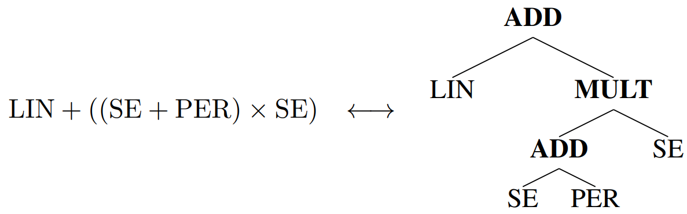

# Structural kernel search via Bayesian Optimization and Symbolical Optimal Tranport

This code is belonging to the NeurIPS 2022 paper [Structural kernel search via Bayesian Optimization and Symbolical Optimal Tranport](https://arxiv.org/abs/2210.11836). The repo can be used to import and run our algorithm (see example) and to reproduce the experimental results in the paper. Please cite the paper when code is used for reproduction, reporting or extending of the method/code.

## Summary of method
Our algorithm does model selection for GP's on the kernel structure level - it searches over a kernel grammar to find the kernel with highest model selection criteria. It first translates a kernel expression (base kernel combined with operators) to a tree e.g.
<p align="center">
  
</p>
and uses BO over tree elements (via optimal transport) to do model selection. The final result is a selected kernel for a given dataset.

## Setup

After cloning the repo or extracting the repo from a zip file, first switch to the base folder where this README lies and build the `conda` environment and the package itself via
```buildoutcfg
conda env create --file environment.yml
conda activate bosot
pip install -e .
```

## Toy example
To test the algorithm on a simulated toy dataset you can call
```buildoutcfg
python -m bosot.examples.bayesian_optimization_kernel_space
```
This example also illustrates how to use our method directly in Python.

## Experiments on datasets
All our experiments in the paper are done on publically available datasets. In order to run our experiments on the datasets one need to download the datasets and put them all
in the same folder: `YOUR_OWN_DATA_PATH`. Besides the dataset folder `YOUR_OWN_DATA_PATH` one also needs an output folder for the experimental results: `YOUR_OWN_OUTPUT_PATH`. In the following we describe how to access the datasets:
### Airline dataset
Download the `airline-passengers.csv` from this publically available repo [Airline Passenger repo](https://github.com/jbrownlee/Datasets/blob/master/airline-passengers.csv). Put the file into `YOUR_OWN_DATA_PATH`.
### LGBB dataset
Download the following publically available zip file [LGBB Download link](https://bobby.gramacy.com/surrogates/lgbb.tar.gz) and put the `lgbb_original.txt` in `YOUR_OWN_DATA_PATH`.
### Powerplant dataset
To get the Powerplant dataset, first download the zip-file from [Powerplant Data Folder](https://archive.ics.uci.edu/ml/machine-learning-databases/00294/). Extract the zip file and open the `.xslx` file in exel. Go to fifth sheet and save it as `power_plant_data.csv` file in `YOUR_OWN_DATA_PATH`.
### Airfoil dataset
To get the Airfoil dataset, download the file `airfoil_self_noise.dat` from [Airfoil Data Folder](https://archive.ics.uci.edu/ml/machine-learning-databases/00291/) and put it into `YOUR_OWN_DATA_PATH`

All necessary dataset preprocessing steps are taken automatically by the dataset wrapper classes. Running our proposed kernel search method can be done via the `bosot/main.py` script as command-line tool. Specifying the dataset is done via the following strings: `[Airfoil, LGBB, PowerPlant, AirlinePassenger]` that need to be set as `--base_data_set_name` argument. We give example configurations for running the scripts (The main script has more arguments which are listed below) where you only need to exchange `YOUR_OWN_DATA_PATH` and `YOUR_OWN_OUTPUT_PATH` with your folders - we note that running the scripts can last fairly long:

Running our method (SOT-Kernel-Kernel) on the Airline dataset can be done via:
```buildoutcfg
python -m bosot.main --data_dir=YOUR_OWN_DATA_PATH --experiment_output_dir=YOUR_OWN_OUTPUT_PATH --n_steps=50 --base_data_n_train=100 --base_data_set_name=AirlinePassenger --kernel_grammar_generator_config=CKSWithRQGeneratorConfig --bayesian_optimizer_config=ObjectBOExpectedImprovementEAFewerStepsConfig --run_name=SOTonAirline
```

Running our method (SOT-Kernel-Kernel) on the LGBB dataset can be done via:
```buildoutcfg
python -m bosot.main --data_dir=YOUR_OWN_DATA_PATH --experiment_output_dir=YOUR_OWN_OUTPUT_PATH --n_steps=50 --base_data_n_train=150 --base_data_set_name=LGBB --kernel_grammar_generator_config=CKSWithRQGeneratorConfig --run_name=SOTonLGBB
```
Running our method (SOT-Kernel-Kernel) on the Powerplant dataset can be done via:
```buildoutcfg
python -m bosot.main --data_dir=YOUR_OWN_DATA_PATH --experiment_output_dir=YOUR_OWN_OUTPUT_PATH --n_steps=50 --base_data_n_train=500 --base_data_set_name=Powerplant --kernel_grammar_generator_config=CKSHighDimGeneratorConfig --run_name=SOTonPowerplant
```

Running our method (SOT-Kernel-Kernel) on the Airfoil dataset can be done via:
```buildoutcfg
python -m bosot.main --data_dir=YOUR_OWN_DATA_PATH --experiment_output_dir=YOUR_OWN_OUTPUT_PATH --n_steps=50 --base_data_n_train=500 --base_data_set_name=Airfoil --kernel_grammar_generator_config=CKSHighDimGeneratorConfig --run_name=SOTonAirfoil
```

Running the Hellinger-Kernel-Kernel approach on the Airline dataset can be done via:
```buildoutcfg
python -m bosot.main --data_dir=YOUR_OWN_DATA_PATH --experiment_output_dir=YOUR_OWN_OUTPUT_PATH --n_steps=50 --base_data_n_train=100 --base_data_set_name=AirlinePassenger --kernel_kernel_config=BasicHellingerKernelKernelConfig --kernel_grammar_generator_config=CKSWithRQGeneratorConfig --bayesian_optimizer_config=ObjectBOExpectedImprovementConfig --run_name=HellingerOnAirline
```

Running Greedy Search on the Airline dataset can be done via:
```buildoutcfg
python -m bosot.main --data_dir=YOUR_OWN_DATA_PATH --experiment_output_dir=YOUR_OWN_OUTPUT_PATH --n_steps=50 --base_data_n_train=100 --base_data_set_name=AirlinePassenger --use_heuristic=True --heuristic_search_config=GreedyKernelSearchBaseInitialConfig --num_stages_heuristics=5 --run_name=GreedyOnAirline
```

Running TreeGEP on the Airline dataset can be done via:
```buildoutcfg
python -m bosot.main --data_dir=YOUR_OWN_DATA_PATH --experiment_output_dir=YOUR_OWN_OUTPUT_PATH --n_steps=50 --base_data_n_train=100 --base_data_set_name=AirlinePassenger --use_heuristic=True --heuristic_search_config=TreeGEPEvolutionaryOptimizerConfig --num_stages_heuristics=5 --run_name=TreeGEPOnAirline
```

## Main File Configuration
Our method and the competitor methods in our paper can be started via the `bosot/main.py` script as command-line tool. Most parameters also come with default values (see `bosot/main.py`). The following list specfies the most important command line parameters:

`--experiment_output_dir`: The output folder, where plots and metrics of the kernel search should be saved (subfolders are generated automatically)

`--data_dir`: Input folder, where all the datasets files lie. Here the classes in the `data_sets` folder will search for the respective files that they expect. Which files they expect is described above.

`--n_steps`: Number of BO iterations, in case of the BO methods is used (only applies if `--use_heuristic=False`).

`--run_name`: Specifies the name of the run - is used to create subfolders and final metric files.

`--base_data_set_name`: Name of the wrapper class corresponding to a dataset. It expects one of the following values: `[Airfoil, LGBB, PowerPlant, AirlinePassenger]`

`--base_data_n_train`: Number of training datapoints that should be sampled uniformly from the whole base dataset.

`--kernel_grammar_generator_config`: Specifies the search space that should be used. It expects one of the following values: `[CKSWithRQGeneratorConfig,CKSHighDimGeneratorConfig]`. Here `CKSWithRQGeneratorConfig` corresponds to the search space for low dimensional datasets and `CKSHighDimGeneratorConfig` for higher dimensional datasets (see paper for details).

`--kernel_kernel_config`: Specifies the kernel-kernel that is used. It expects one of the following values: `[OTWeightedDimsExtendedGrammarKernelConfig,BasicHellingerKernelKernelConfig]` where `OTWeightedDimsExtendedGrammarKernelConfig` is our method (SOT-Kernel-Kernel), which is the default value here. `BasicHellingerKernelKernelConfig` corresponds to the Hellinger Kernel-Kernel.

`--use_heuristic`: Flag if heuristic should be used instead of BO.

`--num_stages_heuristics`: Number of stages in the heuristics. This is the number of stages in Greedy Search or number of generations in TreeGEP.

`--heuristic_search_config`: Specifies which heuristic should be used in case `--use_heuristic=True`. It expects one of the following values: `[GreedyKernelSearchBaseInitialConfig,TreeGEPEvolutionaryOptimizerConfig]`.

`--seed`: Seed value.

## License

BOSOT is open-sourced under the AGPL-3.0 license. See the
[LICENSE](LICENSE) file for details.
